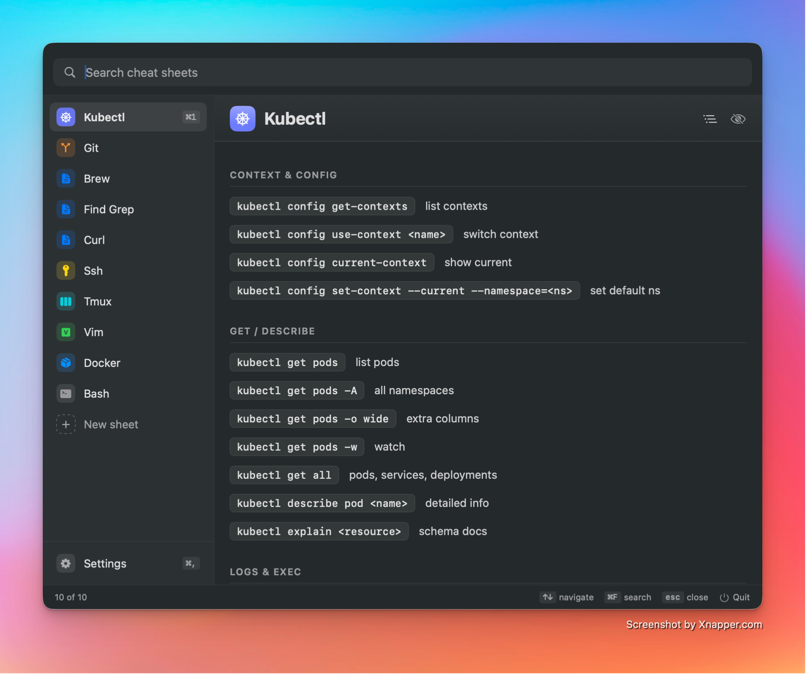
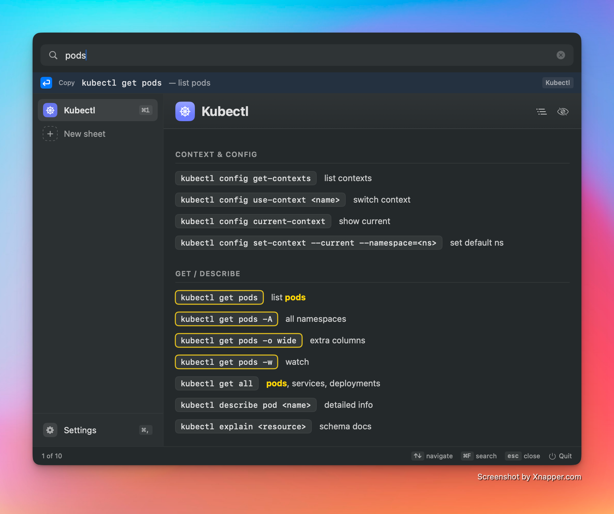
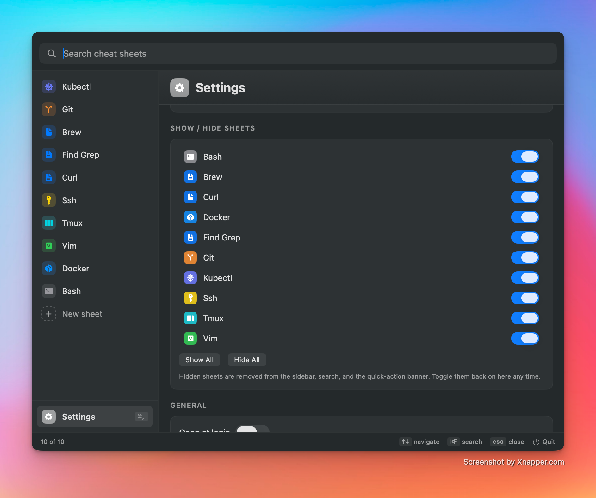

# Cheetos

A macOS menu bar app for quickly viewing cheat sheets for command-line tools (vim, tmux, git, …).

Click the menu bar icon → search → pick a sheet from the sidebar, or press your global shortcut from anywhere.



## Features

- Menu bar app — no dock icon, lives quietly in your status bar
- Optional global hotkey to toggle the window from anywhere
- Fuzzy search across titles and bodies, with match highlighting
- Quick-action banner: press ↩ to copy the top-matching command and dismiss
- Click any `` `command` `` pill or fenced code block to copy it
- 10 bundled sheets, plus drop-in support for your own at `~/.cheetos/`
- Hide individual sheets you don't use
- Auto-reload when files in `~/.cheetos/` change
- Usage-aware sidebar ordering (most-used sheets float to the top)
- ⌘1–⌘9 to jump to a sheet, ⌘F to focus search, ⌘, for Settings
- Open at login toggle



## Requirements
- macOS 14+
- Swift 5.9+ (Xcode 15 or Command Line Tools)

## Build & Run

```sh
./build-app.sh          # produces Cheetos.app
open ./Cheetos.app      # launches; icon appears in menu bar
```

For dev iteration without bundling:

```sh
swift run                # runs the binary directly
```

To codesign with a Developer ID identity (instead of ad-hoc):

```sh
CODESIGN_IDENTITY="Developer ID Application: Your Name (TEAMID)" ./build-app.sh
```

## Adding cheat sheets

Your own sheets live in **`~/.cheetos/`** — created on first launch.

- Click **+ New sheet** in the sidebar (or **Settings → New Sheet…**) to scaffold a stub `.md` and open it in your default editor.
- Or drop any `.md` file into `~/.cheetos/` directly.
- The filename becomes the sheet id; the title is derived from it (`docker-compose.md` → "Docker Compose").
- Cheetos auto-reloads when files change.
- User sheets override bundled ones with the same name — right-click a bundled sheet → **Override with Custom Copy** to start from the bundled content.

Bundled defaults (Git, Vim, Tmux, Bash, Docker, Kubectl, SSH, curl, find/grep, Homebrew) live in `Sources/Cheetos/Resources/cheatsheets/` and ship inside the app.

### Hiding sheets

Don't need a sheet? Right-click it in the sidebar, click the eye-slash icon in the detail header, or toggle it in **Settings → Show / Hide Sheets**. Hidden sheets stay out of the sidebar, search results, and the quick-action banner until you re-enable them.



### Supported markdown subset
- `#`, `##`, `###` headings
- `-` / `*` bullets — lines like `` - `cmd` — description `` render as a copyable pill + description row
- ``` ``` ``` fenced code blocks (with a copy button)
- `` `inline code` ``
- `>` block quotes
- Search highlights match in titles, descriptions, and commands

## Releases

Pushes to `main` (and manual dispatches) trigger `.github/workflows/release.yml`, which builds `Cheetos.app`, optionally codesigns/notarizes it, and publishes a GitHub release with a versioned zip.

Signing tiers (workflow degrades gracefully based on which secrets are set):

| Secrets present | Result |
| --- | --- |
| _(none)_ | Ad-hoc signed; zip contains a `README-unsigned-release.txt` with the quarantine workaround. |
| `APPLE_CERTIFICATE_P12_BASE64`, `APPLE_CERTIFICATE_PASSWORD`, `KEYCHAIN_PASSWORD`, `APPLE_DEVELOPER_ID_APPLICATION` | Developer ID signed. |
| _Above_ + `APPLE_NOTARY_KEY`, `APPLE_NOTARY_KEY_ID`, `APPLE_NOTARY_ISSUER_ID` | Signed, notarized, stapled, and Gatekeeper-verified. |

## Project layout

```
Package.swift
build-app.sh                       # builds + (optionally) codesigns Cheetos.app
.github/workflows/release.yml      # CI build + GitHub release
Sources/Cheetos/
  CheetosApp.swift                 # @main + AppDelegate (status item, floating panel, global hotkey)
  CheatSheetLibrary.swift          # loads .md files, watches ~/.cheetos, tracks usage + hidden state
  ContentView.swift                # sidebar, detail view, markdown renderer
  Settings.swift                   # SettingsStore + HotkeyManager + login-item helpers
  SettingsView.swift               # inline Settings page
  Resources/cheatsheets/
    git.md
    vim.md
    tmux.md
    bash.md
    docker.md
    kubectl.md
    ssh.md
    curl.md
    find-grep.md
    brew.md
```

## Notes
- `LSUIElement = true` in the generated `Info.plist` hides the dock icon, so the app lives only in the menu bar.
- The window is an `NSPanel` (floating, non-activating) — it hides on deactivation, so clicking elsewhere closes it. Press `esc` to close, `⌘,` to open Settings inline.
- Right-click the menu bar icon for **Open / Settings… / Quit**.
- "Open at login" is implemented via `SMAppService` (macOS 13+); the toggle lives in Settings.
